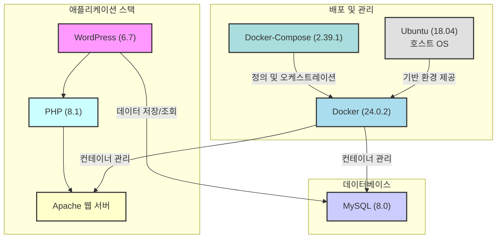

# aix-inha 웹 서버

## 🏗️ 시스템 아키텍처

* **언어/프레임워크**: `PHP(8.1)` / `WordPress(6.7)`
* **데이터베이스**: `MySQL(8.0)`
* **배포 환경**: `Ubuntu (18.04)`
* **CI**: `Docker(24.0.2)/Docker-Compose(2.39.1)`

## 📦 배포 방법
* **경로**: `~/docker_test_wp`

* **배포**: `docker compose up -d / docker-compose up -d`

* **로그 확인**: `docker-compose logs -f`

* **종료**: `docker compose down / docker-compose down`

## 필수 백업 파일

MySQL 데이터

WordPress 프로젝트 파일

HTTPS SSL 인증서 / Apache 설정 파일

## ❓ Issues

- **1. 설정 변경 후 재배포 시 속도 저하**
  - WordPress의 플러그인 충돌로 인한 성능저하가 유력합니다. 플러그인을 하나씩 켜보며 확인

- **2. HTML 숏 코드 가독성**
  - CSS와 HTML 코드를 같이 삽입하면 깨지는 현상(확인 중)

