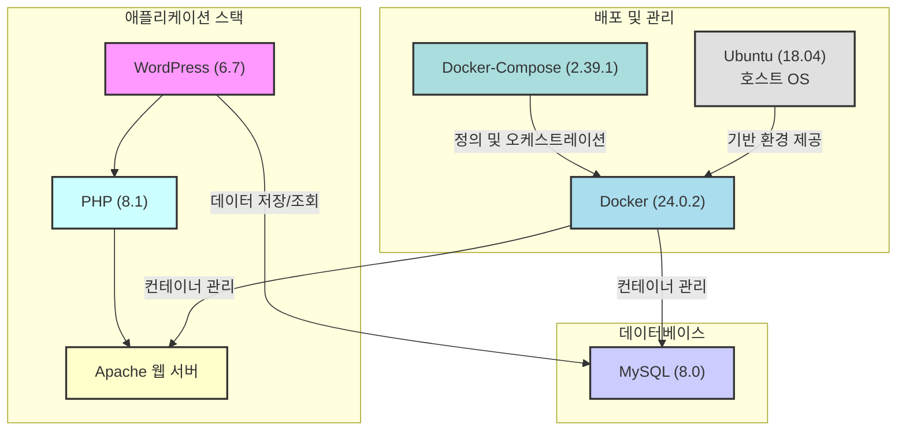

# aix-inha 웹 서버

## 🏗️ 시스템 아키텍처

* **언어/프레임워크**: [`PHP(8.1-apache)`/ `WordPress(6.7)`](https://hub.docker.com/layers/library/wordpress/6.7.2-php8.1-apache/images/sha256-a811cbb857ab651fcc121da60c98fbc1eeeb189bf0d72c389a919f73ef53ad77)
* **데이터베이스**: [`MySQL(8.0-debian)`](https://hub.docker.com/_/mysql)
* **배포 환경**: `Ubuntu (18.04)`
* **CI**: `Docker(24.0.2)/Docker-Compose(2.39.1)`

## 📦 배포 방법
* **경로**: `~/docker_test_wp`

* **배포**: `docker compose up -d / docker-compose up -d`

* **로그 확인**: `docker-compose logs -f`

* **종료**: `docker compose down / docker-compose down`

## 필수 백업 파일

MySQL 데이터 - mysqldump 명령어

WordPress 프로젝트 파일 - 경로 내 html 디렉토리

HTTPS SSL 인증서 / Apache 설정 파일 - 경로 내 apache-config, cert 디렉토리

## ❓ Issues

- **1. 설정 변경 후 재배포 시 속도 저하**
  - WordPress 상의 plugin 상태와 DB 상의 plugin 상태 동기화 오류. 아래의 명령어로 조회하여 추적
  - `ls -la /home/aicenter/docker_test_wp/html/wordpress/wp-content/plugins/ | grep disabled`
  - `sudo docker exec wp_mysql mysql -uaicenter -p526 wp -e "SELECT option_value FROM wp_options WHERE option_name = 'active_plugins';"`
- **2. HTML 숏 코드 가독성**
  - CSS와 HTML 코드를 같이 삽입하면 깨지는 현상(확인 중)

